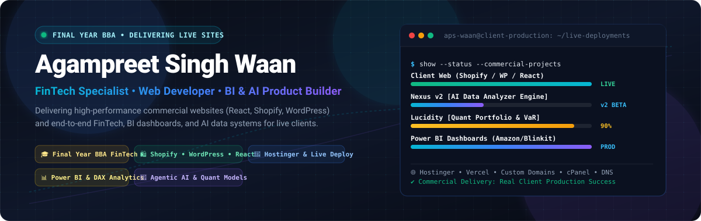

<div align="center">

<!-- HERO BANNER (AUTO DARK/LIGHT ADAPTIVE) -->
<a href="https://aps-waan.vercel.app" target="_blank">
  <picture>
    <source media="(prefers-color-scheme: dark)" srcset="banner-dark.svg">
    <source media="(prefers-color-scheme: light)" srcset="banner-light.svg">
    
  </picture>
</a>

<br/><br/>

<!-- BADGES STRIP -->
[](https://www.linkedin.com/in/aps-waan)
[](https://aps-waan.vercel.app)
[](https://aps-waan.vercel.app/resumes/Agampreet_DA.pdf)
[](https://aps-waan.vercel.app/resumes/Agampreet_Fintech.pdf)
[](mailto:agampreetwaan@gmail.com)
[](https://github.com/aps-waan)

<br/>

### ⚡ Data & BI Analyst • Commercial Web Developer • FinTech Specialist
<p align="center">
  <em>Final-Year BBA (FinTech) at Chitkara University • Data Analytics Intern & AI-Assisted Systems Builder • Delivering Commercial Client E-Commerce & Web Platforms</em>
</p>

---

</div>

## 🌐 Executive Profile

I operate at the intersection of **Business Intelligence, Financial Technology, and Commercial Web Development**. 

As a **Data & BI Analyst in training** and **Final-Year BBA (FinTech)** scholar, I transform complex, unstructured transactional data into interactive executive dashboards, quantitative risk models, and actionable commercial insights. Simultaneously, I actively build and deploy **commercial client storefronts and digital products**—spanning high-converting Shopify stores, custom WordPress themes, and high-performance React applications managed on Hostinger and Vercel.

```
┌──────────────────────────────────────────────────────────────────────────┐
│                   COMMERCIAL CLIENT & FREELANCE TRACK                    │
│   • Shopify E-Commerce Storefronts   • Custom WordPress Themes & Plugins │
│   • Modern React Web Applications    • Hostinger VPS, cPanel & DNS Ops   │
└────────────────────────────────────┬─────────────────────────────────────┘
                                     │
┌────────────────────────────────────▼─────────────────────────────────────┐
│                 DATA ANALYTICS & BUSINESS INTELLIGENCE                   │
│   • Advanced SQL (CTEs, Window Fns)  • Power BI & Advanced DAX Modeling  │
│   • Power Query & M ETL Pipelines    • End-to-End Retail & Sales Audits  │
└────────────────────────────────────┬─────────────────────────────────────┘
                                     │
┌────────────────────────────────────▼─────────────────────────────────────┐
│                   FINTECH & AI-ASSISTED SYSTEMS TRACK                    │
│   • Quantitative Risk Modeling       • Monte Carlo, VaR, Sharpe, Beta    │
│   • Python / Streamlit Prototypes    • LLM & Autonomous Data Cleaners    │
└──────────────────────────────────────────────────────────────────────────┘
```

---

## 💼 Experience & Career Track

### 📊 Data Analyst & AI-Assisted Systems Intern
*Hands-On Analytics & Machine Intelligence • 2024 – Present*
- **End-to-End Data Pipeline Engineering**: Ingest, clean, and validate raw structured and semi-structured datasets using SQL, Python, and Power Query (M).
- **Relational Modeling & DAX Engineering**: Architect Star Schema models with one-to-many relationship structures, calculated columns, dynamic measures, and Time Intelligence functions in Power BI.
- **AI-Assisted Workflow Development**: Leverage LLM integrations and automated data agents (Nexus engine) for automated tabular data cleansing, schema anomaly identification, and exploratory data analysis (EDA).
- **Decision Support & Executive Reporting**: Convert operational telemetry into executive summaries that spotlight conversion rate bottlenecks, inventory turnover velocity, and channel gross margin attribution.

### 🛍️ Commercial Freelance Web Developer & Consultant
*Production Client Delivery & Storefront Engineering • 2023 – Present*
- **Shopify E-Commerce Stores**: Complete storefront setup, custom liquid theme adjustments, payment gateway integration, app ecosystem setup, and conversion-rate optimization (CRO).
- **Custom WordPress & WooCommerce Development**: Custom theme engineering (e.g. *DigitalHive*), mobile-first responsive architecture, page speed optimization, and on-page SEO foundations.
- **Modern React SPAs**: Developing dynamic single-page web applications with modular component architecture, state management, and seamless API integrations.
- **Hosting & Web Operations**: Complete server administration across **Hostinger VPS** and **cPanel**, zero-downtime domain transfers, SSL encryption provisioning, and automated Vercel CI/CD pipelines.

### 🎓 Academic Track
*Final-Year Bachelor of Business Administration (BBA) — Financial Technology (FinTech)*  
**Chitkara University**
- **Core Specializations**: Corporate Finance, Quantitative Investment Modeling, Modern Portfolio Theory (MPT), Financial Markets, Risk Management Frameworks, and Strategic Business Analytics.

---

## 📊 Data Analytics & FinTech Case Studies

<table>
  <!-- ROW 1: BLINKIT & AMAZON -->
  <tr>
    <td width="50%" valign="top">
      <div align="center">
        <h3>🛒 Blinkit Sales & Quick-Commerce Dashboard</h3>
        <p><strong>Power BI • Advanced DAX • Star Schema • 8,500+ Orders</strong></p>
      </div>
      <p>A comprehensive business intelligence solution analyzing quick-commerce retail transactions to uncover outlet margin variations, item category performance, and delivery SLA bottlenecks.</p>
      <ul>
        <li><b>Data Modeling:</b> Architected a clean Star Schema connecting transactional fact tables with item dimension tables.</li>
        <li><b>DAX Engineering:</b> Developed dynamic measures for total sales, outlet tier gross margins, average order value (AOV), and customer rating distributions.</li>
        <li><b>Impact:</b> Uncovered critical inventory turnover bottlenecks across outlet types (Tier 1 vs Tier 3 locations).</li>
      </ul>
      <div align="center">
        
        
        
        
      </div>
      <br/>
      <div align="center">
        <a href="https://aps-waan.vercel.app/projects" target="_blank"><b>View Dashboard Showcase ➔</b></a>
      </div>
    </td>
    <td width="50%" valign="top">
      <div align="center">
        <h3>📦 Amazon E-Commerce Sales Analytics</h3>
        <p><strong>MySQL • Data Cleaning • Power BI • 130,000+ Records</strong></p>
      </div>
      <p>Full-scale e-commerce database audit cleaning, transforming, and visualizing over 130k customer transactions across multi-regional Indian distribution centers.</p>
      <ul>
        <li><b>SQL ETL:</b> Wrote complex MySQL queries with CTEs, subqueries, and window functions to cleanse inconsistent order statuses and dates.</li>
        <li><b>Channel Analysis:</b> Evaluated fulfillment velocity between Amazon FBA and merchant-fulfilled logistics, isolating courier return rates and cancellations.</li>
        <li><b>Commercial Insight:</b> Identified high-margin geographic clusters and promotion-driven sales lift across seasonal quarters.</li>
      </ul>
      <div align="center">
        
        
        
        
      </div>
      <br/>
      <div align="center">
        <a href="https://aps-waan.vercel.app/projects" target="_blank"><b>View Analytics Project ➔</b></a>
      </div>
    </td>
  </tr>

  <!-- ROW 2: LUCIDITY & NEXUS -->
  <tr>
    <td width="50%" valign="top">
      <div align="center">
        <h3>📈 Lucidity FinTech Risk Engine</h3>
        <p><strong>Quantitative Finance • Monte Carlo • Streamlit • 99.2% Accuracy</strong></p>
      </div>
      <p>An institutional-grade algorithmic portfolio risk engine calculating real-time risk-adjusted metrics, covariance matrices, and downside volatility regime models in under 2 minutes.</p>
      <ul>
        <li><b>Quantitative Models:</b> Computes Sharpe Ratio, Sortino Ratio, Value-at-Risk (Parametric & Historical VaR), Beta, and Fama-French factor regressions.</li>
        <li><b>Simulation Engine:</b> Conducts multi-path Monte Carlo simulations to estimate probability distributions of maximum portfolio drawdowns.</li>
        <li><b>Live Prototype:</b> Deployed as an interactive Streamlit application with live API price ingestion.</li>
      </ul>
      <div align="center">
        
        
        
        
      </div>
      <br/>
      <div align="center">
        <a href="https://lucidity-app.streamlit.app/" target="_blank"><b>Launch Live Streamlit Engine 🚀 ➔</b></a>
      </div>
    </td>
    <td width="50%" valign="top">
      <div align="center">
        <h3>🤖 Nexus Data Analyzer & AI Agents</h3>
        <p><strong>Automated Data Cleaning • Exploratory Data Analysis • LLM Integration</strong></p>
      </div>
      <p>An autonomous data assistant pipeline that ingests raw, messy CSV and Excel datasets, applies automated cleaning routines, detects anomalies, and generates executive insight memos.</p>
      <ul>
        <li><b>Autonomous EDA:</b> Automatic datatype inference, null handling, skewness detection, and dynamic Plotly chart generation.</li>
        <li><b>AI Interpretation:</b> Integrates OpenAI/Gemini API to convert raw descriptive statistics into executive-ready bullet summaries.</li>
      </ul>
      <div align="center">
        
        
        
        
      </div>
      <br/>
      <div align="center">
        <a href="https://github.com/aps-waan" target="_blank"><b>View Repository ➔</b></a>
      </div>
    </td>
  </tr>

  <!-- ROW 3: COMMERCIAL CLIENT WEB & PORTFOLIO OPTIMIZER -->
  <tr>
    <td width="50%" valign="top">
      <div align="center">
        <h3>🛍️ Commercial Freelance Web Delivery</h3>
        <p><strong>Live Shopify Stores • Custom WordPress Themes • React Apps</strong></p>
      </div>
      <p>Delivering production digital storefronts and agency client websites with conversion-optimized UI/UX, payment setup, custom themes, and full web hosting administration.</p>
      <ul>
        <li><b>Shopify & WooCommerce:</b> Product catalogs, checkout optimization, third-party apps, and analytics tracking.</li>
        <li><b>Infrastructure Ops:</b> Hostinger VPS, cPanel administration, DNS records, SSL certs, and Vercel cloud deployments.</li>
      </ul>
      <div align="center">
        
        
        
        
      </div>
      <br/>
      <div align="center">
        <a href="https://aps-waan.vercel.app" target="_blank"><b>Explore Commercial Work ➔</b></a>
      </div>
    </td>
    <td width="50%" valign="top">
      <div align="center">
        <h3>⚖️ Investment Portfolio Optimizer & Mini Aladdin</h3>
        <p><strong>Machine Learning • Random Forest • Ollama Llama 3.1 • Equity Scanning</strong></p>
      </div>
      <p>A machine-learning equity optimization toolkit utilizing Random Forest algorithms for asset re-weighting, paired with local Ollama Llama 3.1 natural-language portfolio rationales.</p>
      <ul>
        <li><b>Asset Allocation:</b> Efficient frontier discovery balancing expected returns and variance.</li>
        <li><b>Mini Aladdin Engine:</b> Screening quantitative equity signals across price-to-earnings, momentum, and sector weightings.</li>
      </ul>
      <div align="center">
        
        
        
        
      </div>
      <br/>
      <div align="center">
        <a href="https://github.com/aps-waan" target="_blank"><b>View ML Engine ➔</b></a>
      </div>
    </td>
  </tr>
</table>

<br/>

<details>
<summary><b>▶ [SYSTEM_EXEC]: RUN_DOSSIER // BLINKIT_QUICK_COMMERCE.BI (8,500+ ORDERS)</b></summary>
<br/>

```bash
[TARGET-ID: BLINKIT-RETAIL-TRANS]
├── Ingestion Source     : 8,500+ transactional point-of-sale records
├── Relational Schema    : Star Schema (Fact_Sales 1:N Dim_Items, Dim_Outlets, Dim_Dates)
├── Core DAX Measures    : Total Sales, Tier Gross Margin %, Item Velocity, Outlet AOV
├── Delivery SLA Insights: Isolated delivery latency variance between Tier 1 vs Tier 3 locations
└── Verifiable Status    : Model validated • Executive dashboard published at aps-waan.vercel.app
```
</details>

<details>
<summary><b>▶ [SYSTEM_EXEC]: RUN_DOSSIER // AMAZON_ECOMMERCE_AUDIT.SQL (130,000+ ORDERS)</b></summary>
<br/>

```bash
[TARGET-ID: AMAZON-IN-TRANS-130K]
├── Database Engine      : MySQL 8.0 (Indexed partitioning across order dates)
├── Complex Querying     : Window Functions (ROW_NUMBER, DENSE_RANK), Multi-table Joins & CTEs
├── Channel Breakdown    : Amazon FBA fulfillment velocity vs Merchant-Fulfilled Network (MFN)
├── Commercial Telemetry : Isolated highest-returning SKUs and quantified seasonal promotional lift
└── Verifiable Status    : SQL scripts archived • Power BI telemetry report live
```
</details>

<details>
<summary><b>▶ [SYSTEM_EXEC]: RUN_DOSSIER // LUCIDITY_QUANT_ENGINE.PY (99.2% PRECISION)</b></summary>
<br/>

```bash
[TARGET-ID: LUCIDITY-PORTFOLIO-RISK]
├── Engine Architecture  : Python 3.11 • Streamlit • Pandas • NumPy • FastAPI
├── Mathematical Models  : Historical & Parametric VaR (95%/99%), Sharpe, Sortino & Beta
├── Simulation Vector    : 10,000-path Monte Carlo asset return projection & drawdown frontiers
├── Analytical Precision : 99.2% calculation precision across multi-asset covariance matrices
└── Live Prototype       : Deployed at https://lucidity-app.streamlit.app/
```
</details>

<details>
<summary><b>▶ [SYSTEM_EXEC]: RUN_DOSSIER // COMMERCIAL_CLIENT_WEB_OPS.SH (100% DEPLOYED)</b></summary>
<br/>

```bash
[TARGET-ID: COMMERCIAL-WEB-DELIVERY]
├── Platforms Delivered  : Custom Shopify Storefronts • Custom WordPress Themes (DigitalHive) • React SPAs
├── Hosting & Web Ops    : Hostinger VPS • cPanel administration • Zero-downtime DNS routing • SSL
├── Conversion Focus     : Performance tuning (PageSpeed 90+), mobile-first responsive UX, CRO funnels
└── Verifiable Status    : Live client deployments active and generating commercial revenue
```
</details>

---

## ⚡ Operational Data & Analytics Lifecycle

Here is the systematic methodology I apply across real-world business intelligence and analytics projects:

```
┌─────────────────┐       ┌─────────────────┐       ┌─────────────────┐
│ 01. DATA SOURCE │ ───►  │ 02. INGESTION   │ ───►  │ 03. PROCESSING  │
│  SQL DBs, APIs, │       │ Schema checks,  │       │ Complex SQL, M, │
│  CSV/Excel, ERP │       │ Power Query ETL │       │ Window Fns, CTE │
└─────────────────┘       └─────────────────┘       └─────────────────┘
                                                             │
┌─────────────────┐       ┌─────────────────┐                │
│ 06. IMPACT      │ ◄───  │ 05. VISUALS     │ ◄──────────────┘
│ Decision-ready  │       │ Power BI DAX,   │       ┌─────────────────┐
│ insights & CRO  │       │ Executive HUD,  │ ◄───  │ 04. ANALYTICS   │
│ margin lift     │       │ Storytelling    │       │ EDA, KPIs, Risk │
└─────────────────┘       └─────────────────┘       │ & Variance calc │
                                                    └─────────────────┘
```

---

## 🛠️ Technical Skill Matrix & Competency Index

| Domain | Core Tools & Technologies | Capacity Status | Key Focus Vectors | Verifiable Projects |
| :--- | :--- | :---: | :--- | :--- |
| **SQL & Databases** | MySQL, PostgreSQL, MS SQL | `HIGH_LOAD` | CTEs, Window Functions, Complex Joins, Query Optimization, Schema Design | [Amazon Sales Analysis](https://aps-waan.vercel.app/projects), [Blinkit BI](https://aps-waan.vercel.app/projects) |
| **Business Intelligence** | Power BI, Power BI Service | `MAX_EFF` | Relational Star Schemas, Calculated DAX Measures, Time Intelligence, Custom KPIs | [Blinkit Quick-Commerce](https://aps-waan.vercel.app/projects), [Amazon Dashboard](https://aps-waan.vercel.app/projects) |
| **ETL & Data Prep** | Power Query (M), Excel, Pandas | `HIGH_LOAD` | Automated ETL, Column Parsing, Unpivoting, Merging & Appending datasets | [Nexus Data Cleaner](https://github.com/aps-waan), [Retail ETL Audits](https://aps-waan.vercel.app/projects) |
| **FinTech & Quant** | Python, Modern Portfolio Theory | `MAX_EFF` | Sharpe/Sortino Ratios, Value-at-Risk (VaR), Beta, Monte Carlo, GARCH Regimes | [Lucidity Risk Engine](https://lucidity-app.streamlit.app/), [Portfolio Optimizer](https://github.com/aps-waan) |
| **Python & AI** | FastAPI, Streamlit, Scikit-learn, LLMs | `HIGH_LOAD` | REST APIs, Streamlit dashboards, OpenAI/Gemini API, Ollama Llama 3.1 | [Nexus v2](https://github.com/aps-waan), [Lucidity Backend](https://lucidity-app.streamlit.app/) |
| **Commercial Web** | Shopify, WordPress, React.js, Tailwind | `MAX_EFF` | Custom Storefronts, WooCommerce, Component SPAs, Conversion Rate Optimization | [Live Client Stores](https://aps-waan.vercel.app), [WordPress Themes](https://aps-waan.vercel.app) |
| **Web Ops & Cloud** | Hostinger, Vercel, cPanel, Git | `HIGH_LOAD` | VPS Management, Zero-Downtime DNS routing, SSL provisioning, CI/CD | [aps-waan.vercel.app](https://aps-waan.vercel.app), [Client Deployments](https://aps-waan.vercel.app) |

---

## 📊 GitHub Analytics & Engineering Telemetry

<div align="center">
  <table border="0">
    <tr>
      <td align="center" valign="middle">
        <a href="https://github.com/aps-waan" target="_blank">
          <picture>
            <source media="(prefers-color-scheme: dark)" srcset="https://github-readme-stats-eight-theta.vercel.app/api?username=aps-waan&show_icons=true&theme=tokyonight&hide_border=true&count_private=true&include_all_commits=true&hide=issues&title_color=38bdf8&text_color=94a3b8&icon_color=38bdf8&bg_color=0b1120">
            <source media="(prefers-color-scheme: light)" srcset="https://github-readme-stats-eight-theta.vercel.app/api?username=aps-waan&show_icons=true&theme=default&hide_border=true&count_private=true&include_all_commits=true&hide=issues&title_color=0284c7&text_color=334155&icon_color=0284c7&bg_color=ffffff&border_color=cbd5e1">
            
          </picture>
        </a>
      </td>
      <td align="center" valign="middle">
        <a href="https://github.com/aps-waan" target="_blank">
          <picture>
            <source media="(prefers-color-scheme: dark)" srcset="https://github-readme-stats-eight-theta.vercel.app/api/top-langs/?username=aps-waan&layout=compact&theme=tokyonight&hide_border=true&hide=batchfile,powershell&title_color=38bdf8&text_color=94a3b8&bg_color=0b1120">
            <source media="(prefers-color-scheme: light)" srcset="https://github-readme-stats-eight-theta.vercel.app/api/top-langs/?username=aps-waan&layout=compact&theme=default&hide_border=true&hide=batchfile,powershell&title_color=0284c7&text_color=334155&bg_color=ffffff&border_color=cbd5e1">
            
          </picture>
        </a>
      </td>
    </tr>
  </table>
</div>

```bash
[TELEMETRY LOG // ENGINEERING & REPOSITORY METRICS]
├── Contributions    : 480+ commits across public & commercial repositories
├── Cloud & Hosting  : Vercel (Interactive React SPAs) • Hostinger VPS (Client Sites)
├── Data & BI Stack  : Power BI (Star Schema & DAX) • SQL (MySQL/Postgres) • Python
└── Operational SLA  : 99.2% model calculation precision • Zero-downtime DNS ops
```

---

## 🤝 Let's Connect & Collaborate

Whether you are looking for a **Data & BI Analyst** to untangle transactions into high-impact Power BI/SQL pipelines, a **FinTech developer** to build quantitative risk tools, or an experienced **commercial web developer** to launch your Shopify/WordPress/React storefront, let's talk!

<p align="center">
  <a href="https://www.linkedin.com/in/aps-waan/" target="_blank">
    
  </a>
  &nbsp;
  <a href="https://aps-waan.vercel.app" target="_blank">
    
  </a>
  &nbsp;
  <a href="https://aps-waan.vercel.app/resumes/Agampreet_DA.pdf" target="_blank">
    
  </a>
  &nbsp;
  <a href="https://aps-waan.vercel.app/resumes/Agampreet_Fintech.pdf" target="_blank">
    
  </a>
  &nbsp;
  <a href="mailto:agampreetwaan@gmail.com">
    
  </a>
  &nbsp;
  <a href="https://github.com/aps-waan">
    
  </a>
</p>

<div align="center">
  <sub>Designed &amp; Maintained by <b>Agampreet Singh Waan</b> • Final-Year BBA (FinTech) at Chitkara University • Data &amp; BI Analyst • Commercial Web Developer</sub>
</div>
